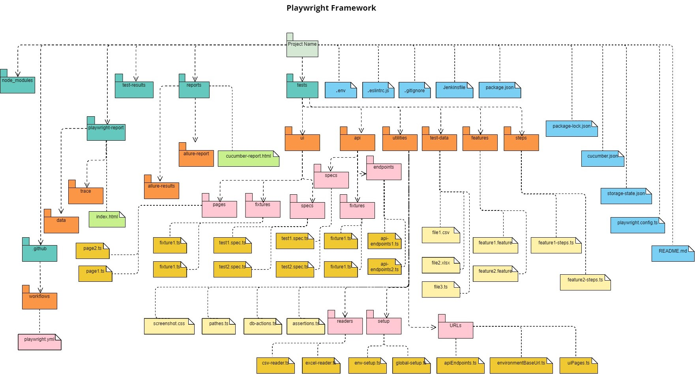

# Jameah Test Automation Framework

*- This project is a test automation framework using playwright test automation tool and typescript programming language for jameah website.*

## `Preparation:`

### A. Pre-requirements:

#### 1- Download and install latest nodejs through the below link
https://nodejs.org/en/download
        
#### 2- Download and install visual studo code throw the below link
https://code.visualstudio.com/download

### B. Project readiness

#### 1- Clone the project

#### 2- Run the below command to install the required dependencies

        npm install

## `Contents:`

### A. Folders and directories:

#### 1- tests/specs/:
* All frontend test cases scripts

#### 2- tests/pages/:
* All frontend pages

#### 3- tests/test-data/:
* All test data files with different types (json format, csv and excel sheets)

#### 4- tests/utilities/setup/:
* global-setup.ts: for Global Setup method implementation
* env-setup.ts: for adjusting the data needed for every environment (test, preprod and production)

#### 5- tests/utilities/URLs/:
* environmentBaseUrl.ts: base URL for every environment
* uiPages.ts: all routs and endpoints for frontend pages

#### 6- tests/utilities/:
* assertions.ts: general implementation for used assertions in different modules
* paths.ts: all used files paths in different modules (data files, screenshots, ...)
* screenshot.css: visual testing configuration for dynamic pages

#### 14- reports/:
* Allure report data
* Other needed reports

#### 15- playwright-report/:
* Playwright default reports (html, line, dot, json, junit, ...)

#### 16- test-results/:
* All results of test cases runs (screenshots, vidos, trace, ...)

#### 17- node_modules/:
* All downloaded libraries and modules

### B. Project configuration files:

#### 1- playwright.config.ts: 
* The default generated file is "playwright.config.ts"
* Waits, browsers, fully parallel, reporters, default number of worksers, ...
* General configurations across the project

#### 2- package.json:
* Project properties
* Scripts and keywords
* Installed dependencies

#### 3- package-lock.json:
* Detailed Installed dependencies

#### 4- .gitignore:
* All files and folders that needs to be excluded from pushing to the version control

#### 5- .env:
* Environment variables
* Secrets
* Running language

#### 6- storageState:
* To save login cookies and optimizing authentication

## `How to run?`

### A. Running normal test cases:

#### 1- Use direct command as below:

        npx playwright test

#### 2- Show the report:

        npx playwright show-report

#### 3- To pass the used environment or language you can use the below bash command:

        ENV=staging npx playwright test

### B. Running test cases using a pre-defined script in package.json:

        npm run {predefined command}

#### 2- Check the errors across the files

## `Project Structure:`
*The below is a package diagram for the implemented project structure "Files and folders"*

## `General instructions and guidelines:`

* Specify files and tags that should be run according to business group and testing needs

* Configure package.json file for frequently used commands

* Configure .env file for test environment, secrets and used language

* Every test should have its representative name

* Pages should hold locators, strings, actions and assertions

* Assertions uses playwright validations and assertion module

* It is recommended to collect cases under describe group

* Files and folders should be named with this formate {firstWord-SecondWord..}

* Variables and methods should start with small letters

* Write locators, scenario steps and tests in the order of the page under test

* Do not assert on existence of a certain element if we will assert on its text

* Do not write any functions if you will not use it